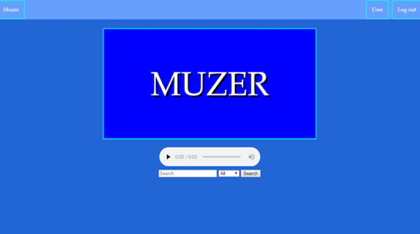
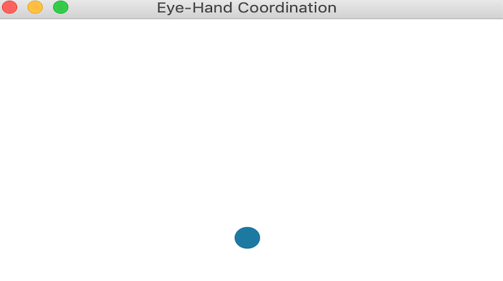

<!DOCTYPE html>
<html>
	<head>
		<meta charset="utf-8">
		<meta http-equiv="X-UA-Compatible" content="IE=edge">
		<meta name="viewport" content="width=device-width, initial-scale=1">
		<!-- The above 3 meta tags *must* come first in the head; any other head content must come *after* these tags -->
		
		
		<title>Nick Pounders Portfolio Website</title>
		
		
		<!--CSS Stylesheets-->
		<link rel='stylesheet' type='text/css' href='bootstrap/css/bootstrap.min.css' >
		<link rel='stylesheet' type='text/css' href='css/linea.css' >
		<link rel='stylesheet' type='text/css' href='css/ionicons.min.css' >
		<link rel='stylesheet' type='text/css' href='css/owl.carousel.css' >
		<link rel='stylesheet' type='text/css' href='css/magnific-popup.css' >
		<link rel='stylesheet' type='text/css' href='css/style.css' >
		
	</head>
	<body>
		
		
		<!--Preloader-->
		

			

			

			

		

		
		
		

			
			<!--=====================================================
				Page Borders
			=====================================================-->
			

			

			

			

			
			
			
			<!--=====================================================
				Menu Button
			=====================================================-->
			<a href='#' class='menu-btn' >
				
					
					
					
				
			</a>
			
			
			<!--=====================================================
				Menu
			=====================================================-->
			

				

					<ul class='menu-items' >
						
						<li>
							<a href='#' class='section-toggle' data-section='intro' >
								Home
							</a>
						</li>
						
						<li>
							<a href='#about' class='section-toggle' data-section='about' >
								About
							</a>
						</li>
						
						<li>
							<a href='#resume' class='section-toggle' data-section='resume' >
								Resume
							</a>
						</li>
						
						<li>
							<a href='#portfolio' class='section-toggle' data-section='portfolio' >
								Portfolio
							</a>
						</li>
						
						
						<li>
							<a href='#contact' class='section-toggle' data-section='contact' >
								Contact
							</a>
						</li>
						
						
					</ul>
				

			

			
			

			
			
			<!--=====================================================
				Sections
			=====================================================-->
			

				
				<!--=====================================================
					Main Section
				=====================================================-->
				<section id='intro' class='section section-main active' >
					
					

						
						

							

								

									
									<h1>I'm Nick Pounders</h1>
									
									

										Welcome to my portfolio website
									

									
									

										
										<a href='#about' class='btn-custom section-toggle' data-section='about' >
											Discover More
										</a>
										
										
										
									

									
								

							

							
						

						
					

				
				</section>
				
				
				<!--=====================================================
					About Section
				=====================================================-->
				<section id='about' class='section about-section border-d' >
					
					

						

							
							

								<h2>
									I'm an aspiring <strong class='color' >Software Engineer</strong>
								</h2>
							

							
							

								
								

									
									<ul class='info-list' >
										
										<li>
											<strong>Name:</strong>
											Nick Pounders
										</li>
										
										
										
								
										
										<li>
											<strong>Residence:</strong>
											Woodstock, GA
										</li>
										
										<li>
											<strong>Education:</strong>
											Kennesaw State University 
											Degree: Computer Science December 2018
										</li>
										
										
										<li>
											
											
											
										</li>
										
										
										
									</ul>
									
								

								
								

								
									

										

											Welcome to my portfolio website! I’m a recent Computer Science graduate from Kennesaw State University. Go Owls! My primary focus at Kennesaw was focused on understanding web development technologies. One of my favorite projects and an example of my work is the site, Making My Own Sunshine Blog, which I created with Ruby on Rails. I definitely see why it became so popular. I have also worked on several other projects, from websites to simple games which you can explore in greater detail by viewing <a href='#portfolio'  data-section='portfolio' >
											my portfolio</a>. Now that I have graduated, I hope to do some research on mobile development, artificial intelligence, machine learning, and open source. Also, I look forward to joining a team where I can explore further growth and development in my career.
											  

											My path towards a degree in computer science is slightly unusual, as I am what you call a returning learner. I received my associates degree in Electronic/Computer Engineering Technology in 2011 before entering the work force. The last 5 years I have been developing single-use and infection prevention medical devices for the gastro-intestinal physician. When I decided to return to school and complete my Bachelor’s degree of study, my passion for the field of technology, combined with my interest in programming led me to choose Computer Science as my focus. From a young age I had always been interested in technology. I remember sitting around the home computer and connecting to the internet for the first time, the excitement of technology progressing and funny sounds from dial-up internet. Since then I have been on a journey to understand and learn technology.

											  
											Outside of my professional life, I like to take continuing education courses, spend time with my family, and watch movies or play video games when time permits. 

										

										
										
										
									

									
									

										
										<a href='/img/Nick_Pounders_Resume.pdf' download class='btn-custom btn-color' >
											Download Resume
										</a>
										
										<a href='#portfolio' class='btn-custom section-toggle btn-color' data-section='portfolio' >
											Portfolio
										</a>
										
									

									
								

								
							

							
						

					

					
					
					
					

						

							
							

								
								<h2>
									My <strong class='color' >Skills</strong>
								</h2>
								
							

							
							

								
								

									
									

										
										<h4>Java</h4>
										<h4>SQL</h4>
										<h4>HTML</h4>
										<h4>CSS</h4>
										<h4>Javascript</h4>
										<h4>Python</h4>
										<h4>Ruby/Rails</h4>
										<h4>Bash/Perl Scripting</h4>
										<h4>Git</h4>
										<h4>Microsoft Office</h4>
										<h4>Linux/Unix</h4>
										<h4>Web Development</h4>
										<h4>Critical Thinking</h4>
										<h4>Communication</h4>
										<h4>Collaboration</h4>
										<h4>Coding</h4>
										<h4>Logic</h4>
										
									

									
									
									
									
								

								
								
								
							

							
							
						

					

					
					
					
				</section>
				
				
				<!--=====================================================
					Resume Section
				=====================================================-->
				<section id='resume' class='section resume-section border-d' >
					
					

						
						

							
							

								
								<h2>My <strong class='color' >Education</strong></h2>
								
							

							
							<ul class='timeline' >
								
								<li>
									
									

										
										<h4>Kennesaw State University</h4>
										
										<em>
											Bachelors of Science
											Computer Science
											2015-2018
										</em>
										
										

											Honors: magna cum laude GPA 3.76/4.00 
											Upsilon Pi Epsilon Honor Society Member 
										
 
										<h4>Relevant Coursework:</h4>
										<ul style="list-style-type:circle;">
											<li>Programing Principals I&II</li>
											<li>Intro to Database Systems && Advanced Database</li>
											<li>Advanced Database</li>
											<li>Operating Systems</li>
											<li>Linux/Unix Administration</li>
											<li>Internet Programming</li>
											<li>Intro to Software Engineering</li>
											<li>Software Architecture and Design</li>
											<li>Software System Requirements</li>
											<li>Concepts of Programming Languages</li>
											<li>Algorithm Analysis</li>
											
										</ul>
										
									

									
								</li>
								
								<li>
									
									

										
										<h4>Chattahoochee Technical College</h4>
										
										<em>
											Associates of Science
											Electronic/Computer Engineering Technology
											2009-2011
										</em>
										
										

											GPA 3.97/4.0
										

										
									

									
								</li>
								
								
								
								
								
							</ul>
							
						

						
					

					
					

						
						

							
							

								
								<h2>My <strong class='color' >Experience</strong></h2>
								
							

							
							<ul class='timeline' >
								
								<li>
									
									

										
										<h4>Boston Scientific</h4>
										
										<em>
											R&D Specialist
											2013-Present  
											Honors: Boston Scientific 2016 Engineering Excellence Award
										</em>
										
										<ul style="list-style-type:circle;">
											<li>Development of verification and validation test methods, protocols, and reports in an FDA regulated industry. 
											</li>
											<li>Project support by performing various tasks in relation to product design, fixture design, materials testing, proto-type building, FMEA analysis, design reviews, etc.
											</li>
											<li>Calibration Management System Administrator: coordinate all activities for location to ensure all equipment stays in a qualified calibrated state.
											</li>
										
											
										</ul>
									
										
									

									
								</li>
								
								<li>
									
									

										
										<h4>FLIR Integrated System</h4>
										
										<em>
											Electrical/Mechanical Technician
											2012-2013
										</em>
										
										<ul style="list-style-type:circle;">
											<li>Installed electrical and electronic parts and hardware in housings or assemblies, using hand tools and soldering equipment. 
											</li>
											<li>Read blueprints, schematics, diagrams, and technical orders to determine methods and sequences of assembly.
											</li>
											<li>Troubleshot electrical and mechanical problems to determine route cause of issue and recommended a corrective action.
											</li>
										
											
										</ul>
										
										
									

									
								</li>
								
								<li>
									
									

										
										<h4>RE/MAX Regional Services</h4>
										
										<em>
											Technical Services Coordinator
											2011-2012
										</em>
										
										<ul style="list-style-type:circle;">
											<li>Provided day-to-day contact for users, actively sought out resolution to user problems with designated product/ service lines and trained numerous remote offices on company provided software platforms. 
											</li>
											<li>Provided office network support for servers, computers/laptop, printer/copier, backup routines, virus protection etc.
											</li>
											<li>Salesforce.com Administrator.
											</li>
										
											
										</ul>
										
										
									

									
								</li>
								
								
								
							</ul>
							
						

						
					

					
					
					
				</section>
				
				
				<!--=====================================================
					Portfolio Section
				=====================================================-->
				<section id='portfolio' class='section portfolio-section border-d' >
					
					

						
						

							
							
							

								<h2>My <strong class='color' >Works</strong></h2>
							

							
							<ul class='portfolio-filters' >
								<li>
									<a href='#' class='active' data-group='all' >
										All
									</a>
								</li>
								<li>
									<a href='#' data-group='web' >
										Web
									</a>
								</li>
								<li>
									<a href='#' data-group='tech' >
										Tech
									</a>
								</li>
								
							</ul>
							
							<ul class='portfolio-items' >
								
								<li data-groups='["web"]' >
									

										
										
										

											
											<a href='#popup-1' class='view-project' >
												View Project
											</a>
											
											<!--project popup-->
											

												<figure>
													
													<!--project popup image-->
													
												
												</figure>
												

													
													<!--project popup title-->
													<h4>Making My Own Sunshine Blog</h4>
													
													<!--project popup description-->
													

														This project was created using Ruby on Rails. I created this project because my wife used to have a blog website, but she no longer was able to keep the site for a variety of reasons. I saw this as an opportunity for me to explore the Ruby on Rails framework, and to create a free blog website to meet the needs of my wife while overcoming the reasons she let her previous site go. Additionally, I found this to be a great opportunity for me to gain the experience of working with a customer with specific requests and/or needs by allowing her to help dictate the design and requirements of the website. This is still a work in progress but visit the site at
														<a href="https://makingmyownsunshine.herokuapp.com" target="_blank"> Making My Own Sunshine</a>
													

													
												

												
											

											
										

										
									

								</li>
								
								<li data-groups='["tech","web"]' >
									

										
										
										

											
											<a href='#popup-2' class='view-project' >
												View Project
											</a>
											
											<!--project popup-->
											

												<figure>
													
													<!--project popup image-->
													
												
												</figure>
												

													
													<!--project popup title-->
													<h4>Project Muzer</h4>
													
													<!--project popup description-->
													

														Muzer is an application that turns your home computer into a server. This was a group project for our senior software design capstone class inspired by our collective frustration with having to pay to stream our own music or having to pay for expensive portable devices. By creating this application to turn your computer into a server, users can access and stream their own music by connecting to the internet anywhere. This application project was created using the MERN stack. MongoDB, Express.js, React, and Node.js. To ensure security / privacy we used Google OAuth for user authentication.
													

													
												

												
											

											
										

										
									

								</li>
								
								<li data-groups='["web"]' >
									

										
										
										

											
											<a href='#popup-3' class='view-project' >
												View Project
											</a>
											
											<!--project popup-->
											

												<figure>
													
													<!--project popup image-->
													
												
												</figure>
												

													
													<!--project popup title-->
													<h4>KSU Bookstore</h4>
													
													<!--project popup description-->
													

														This project was created using Microsoft ASP.NET framework, and like it sounds this was a site designed to operate similar to the real life KSU bookstore. This was a group project I worked on for an intro to software engineering class. In this instance, our professor served as the client and we went through the waterfall development method. We performed requirements analysis, design, implementation and testing of a site where users could search and purchase books for KSU classes.    
													

													
												

												
											

											
										

										
									

								</li>
								
								<li data-groups='["tech"]' >
									

										
										
										

											
											<a href='#popup-6' class='view-project' >
												View Project
											</a>
											
											<!--project popup-->
											

												<figure>
													
													<!--project popup image-->
													
												
												</figure>
												

													
													<!--project popup title-->
													<h4>Color Sampler with Java FX</h4>
													
													<!--project popup description-->
													

														This project is simple application that I created in order to practice the concepts of JavaFx. This program displays a color. There are 6 buttons that allow the user to adjust up or down the Hue, Brightness and Saturation and the new color is displayed.  
													

													
												

												
											

											
										

										
									

								</li>
								
								
								<li data-groups='["tech", "web]' >
									

										
										
										

											
											<a href='#popup-5' class='view-project' >
												View Project
											</a>
											
											<!--project popup-->
											

												<figure>
													
													<!--project popup image-->
													
												
												</figure>
												

													
													<!--project popup title-->
													<h4>Create Webmaps with Python and Folium</h4>
													
													<!--project popup description-->
													

														Like many people, I appreciate a well-designed and functional map. This is why so many people find Google maps preferable. In this instance, I created a web map with 2 layers that can be turn on or off using Folium. Folium is a powerful Python library that helps you create several types of Leaflet maps. In this particular map, the first layer shows the population of the area based on color with the second layer showing locations of volcanos with pop-up dots that can be clicked to show elevation.
 
													

													
												

												
											

											
										

										
									

								</li>

								

								<li data-groups='["tech"]' >
									

										
										
										

											
											<a href='#popup-7' class='view-project' >
												View Project
											</a>
											
											<!--project popup-->
											

												<figure>
													
													<!--project popup image-->
													
												
												</figure>
												

													
													<!--project popup title-->
													<h4>Simple Calculator with Java FX</h4>
													
													<!--project popup description-->
													

														This project is a simple application that I created in order to practice the concepts of JavaFx. This program displays a simple calculator where users can enter two operands and choose to add, subtract, multiple, or divide.
													

													
												

												
											

											
										

										
									

								</li>
								
								<li data-groups='["tech"]' >
									

										
										
										

											
											<a href='#popup-8' class='view-project' >
												View Project
											</a>
											
											<!--project popup-->
											

												<figure>
													
													<!--project popup image-->
													
												
												</figure>
												

													
													<!--project popup title-->
													<h4>Mouse Events with Java FX</h4>
													
													<!--project popup description-->
													

														This project is a simple application that I created in order to practice the concepts of JavaFx. This program displays two circles that are attached by a line.  The distance in pixels is displayed above the line.  The user can click and drag either of the circles to move them.  The line that connects the circles moves with the circle being dragged and the distance is also updated while the circle is being dragged.  
													

													
												

												
											

											
										

										
									

								</li>

								<li data-groups='["tech"]' >
									

										
										
										

											
											<a href='#popup-4' class='view-project' >
												View Project
											</a>
											
											<!--project popup-->
											

												<figure>
													
													<!--project popup image-->
													
												
												</figure>
												

													
													<!--project popup title-->
													<h4>Card Shuffle with JavaFX</h4>
													
													<!--project popup description-->
													

														This project is a simple application that I created in order to practice the concepts of JavaFx.  This program uses and Array List to simulate the 52 cards of the deck.  The Array List is shuffled and the top 3 cards are displayed on the screen.
													

													
												

												
											

											
										

										
									

								</li>

								<li data-groups='["tech"]' >
									

										
										
										

											
											<a href='#popup-11' class='view-project' >
												View Project
											</a>
											
											<!--project popup-->
											

												<figure>
													
													<!--project popup image-->
													
												
												</figure>
												

													
													<!--project popup title-->
													<h4>Circle Bounds with JavaFX</h4>
													
													<!--project popup description-->
													

														This project is a simple application that I created in order to practice the concepts of JavaFx. When the user left clicks on the screen a circle appears which is bounded by a rectangle.  As the user continues to left click more circles appear and they are all bounded by the same rectangle.  When the user right clicks on a circle it disappears and the rectangle is updated to bound the remaining circles.
													

													
												

												
											

											
										

										
									

								</li>

								<li data-groups='["tech"]' >
									

										
										
										

											
											<a href='#popup-10' class='view-project' >
												View Project
											</a>
											
											<!--project popup-->
											

												<figure>
													
													<!--project popup image-->
													
												
												</figure>
												

													
													<!--project popup title-->
													<h4>Data Analysis with Pandas</h4>
													
													<!--project popup description-->
													

														In my personal pursuit of learning Python programming language, I studied the open source library Pandas.  This library is for data manipulation and analysis and offers data structures and operation for manipulating numerical tables and time series.
													

													
												

												
											

											
										

										
									

								</li>

								<li data-groups='["tech"]' >
									

										
										
										

											
											<a href='#popup-9' class='view-project' >
												View Project
											</a>
											
											<!--project popup-->
											

												<figure>
													
													<!--project popup image-->
													
												
												</figure>
												

													
													<!--project popup title-->
													<h4>Eye-Hand Coordination with Java FX</h4>
													
													<!--project popup description-->
													

														This project is simple game that I created in order to practice the concepts of JavaFx. This program displays a circle with a radius of 10 pixels. Each time the circle is filled with a random color and is displayed at a random location on a pane. When you click the circle, it disappears and a new circle is displayed. After 5 circles are clicked, the time spent is displayed in the pane. The purpose of this game is to test your eye-hand coordination by requiring a player to first locate a circle, and then perform an action. The randomization of both location and color helps eliminate players from identifying a pattern. Players can repeat the game to improve their times and practice their eye-hand coordination.
													

													
												

												
											

											
										

										
									

								</li>
								
							</ul>
							
						

					
					

					
				</section>
				
				
				<!--=====================================================
					Contact Section
				=====================================================-->
				<section id='contact' class='section contact-section border-d' >
					
					

						
						

							
							

								<h2>Contact <strong class='color' >Me</strong></h2>
								<h2>Nick Pounders</h2>
							

							
							
							

							
			
								

									
									

										
										

											
											<i class='ion-ios-location-outline' ></i>
											
										
											

												226 Hiawassee Drive 
												Woodstock, GA 30188
											

											
										

										
										
										

											
											<i class='ion-ios-telephone-outline' ></i>
											
											

											 
												404-520-0033
											

											
										

										
										
										

											
											<i class='ion-android-globe' ></i>
											
											

											 
												nickpounders@gmail.com
											

											
										

										
										
										
										
									

									
									
									
								

								
								
							

							
							
							
						

					
					

					
				</section>
				
			

			
		

		
		
		<!--=====================================================
			JavaScript Files
		=====================================================-->
		
		
		
		
		
		
		
	</body>
</html>